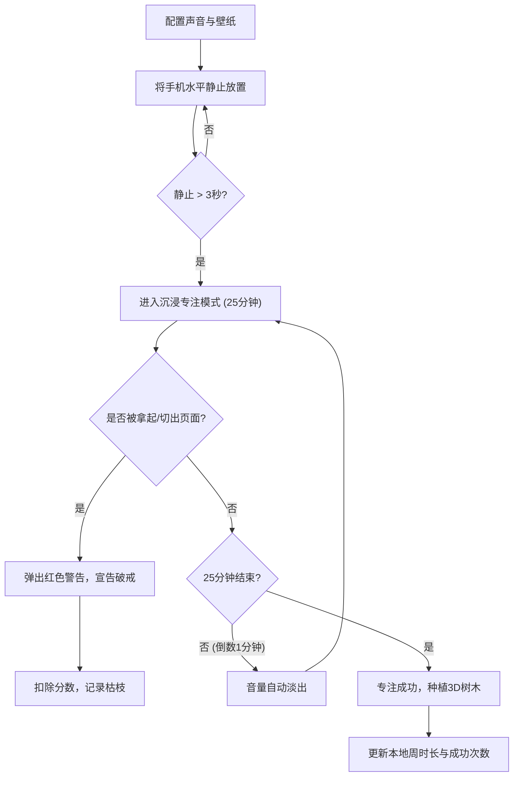

## 1. 产品概述
《摸鱼守护者 2.0 —— 赛博禅修自定义工作台》是一款专注于防沉迷与效率提升的响应式 Web 应用。
通过“浏览器原生传感器”与“页面可见性拦截”双重机制，强制用户在学习或工作时脱离手机屏幕，配合沉浸式白噪音与动态壁纸，打造治愈系的高效专注体验。

## 2. 核心功能模块

### 2.1 角色定义
本项目无传统后端注册系统，所有用户均基于本地离线存储（LocalStorage）记录专属数据。

### 2.2 功能模块划分
1. **工作台主页**：状态检测、沉浸式专注倒计时、多轨白噪音控制、视觉壁纸搜索。
2. **赛博森林（成就面板）**：专注数据统计、成功/失败状态的可视化植物渲染。

### 2.3 页面详情
| 页面名称 | 模块名称 | 功能描述 |
|-----------|-------------|---------------------|
| 主页 | 物理结界 (Sensor) | 监听手机静止状态，超过3秒自动进入专注模式；检测到移动则判定破戒 |
| 主页 | 软件结界 (Visibility) | 监听页面可见性，切出标签页或后台立刻判定专注失败 |
| 主页 | 听视觉联动 (Media) | 对接 Freesound 与 Unsplash API，支持搜索白噪音与壁纸，带音量滑块与倒计时渐弱 |
| 主页 | 数据看板 (Stats) | 记录成功/失败次数，使用 Icons8 免费 3D 树木渲染赛博森林，失败展示乱码或枯枝 |

## 3. 核心流程
用户启动专注的核心流程如下：

## 4. 界面设计 UI
### 4.1 设计风格
- **主色调**：暗黑模式优先（Dark Mode First），搭配深邃的背景黑与流体渐变。
- **视觉特效**：高级治愈系审美，大面积使用毛玻璃质感（`backdrop-blur-md`）、半透明遮罩（`bg-black/50`）。
- **字体排版**：极简现代，大字体的毛玻璃时钟展示，确保视觉焦点清晰。
- **状态颜色**：警告态使用高饱和度红色（如 `text-red-500`），成功态使用治愈系绿色/青色。

### 4.2 页面设计概览
| 页面名称 | 模块名称 | UI 元素 |
|-----------|-------------|-------------|
| 主页 | 专注倒计时 | 全屏暗黑背景、中央巨大数字时钟、半透明操作区 |
| 主页 | 报警弹窗 | 醒目红色高对比度弹窗、震动动画效果 |
| 主页 | 赛博森林 | 卡片式布局，网格排列 3D 树木图标，毛玻璃容器 |

### 4.3 响应式策略
- **Mobile First**：针对手机浏览器屏幕进行完美适配。
- **触控优化**：滑块控件（Slider）与按钮具备良好的触控响应区域。
