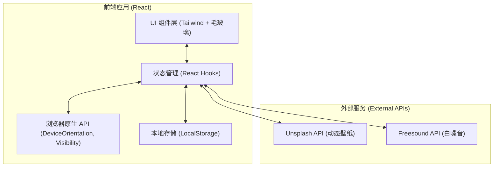

## 1. 架构设计
本项目采用纯前端架构，无需部署后端服务，数据持久化完全依赖浏览器本地存储。



## 2. 技术栈说明
- **核心框架**：React@18
- **构建工具**：Vite
- **样式方案**：Tailwind CSS v3 (启用暗黑模式支持)
- **图标库**：Lucide React
- **持久化**：原生 LocalStorage 封装

## 3. 核心 API 定义
### 3.1 Unsplash 图片获取
- 接口：`GET https://api.unsplash.com/search/photos`
- 参数：`query` (关键词), `orientation=portrait`
- 鉴权：Header 携带 Client-ID (注：前端直连需用户输入 Key 或配置代理，本项目优先使用 Unsplash Source 的平替公开 API，如无缝嵌入 `https://images.unsplash.com/...` 等形式作为免配壁纸)。

### 3.2 浏览器原生接口
- **物理结界**：`window.addEventListener('deviceorientation', ...)` 获取 `alpha, beta, gamma` 角度数据。
- **软件结界**：`document.addEventListener('visibilitychange', ...)` 判断 `document.hidden` 属性。

## 4. 数据模型
### 4.1 LocalStorage 数据结构定义
基于 JSON 格式存储于 `fish_guardian_stats` key 中。

```typescript
interface FocusStats {
  successCount: number; // 成功次数
  failCount: number; // 失败次数
  weeklyTimeMinutes: number; // 本周专注总时长
  forest: TreeItem[]; // 赛博森林植物列表
}

interface TreeItem {
  id: string; // 唯一标识
  timestamp: number; // 种植时间
  status: 'success' | 'failed'; // 成功(3D树)或破戒(枯树/乱码)
  duration: number; // 专注时长(分钟)
}
```
